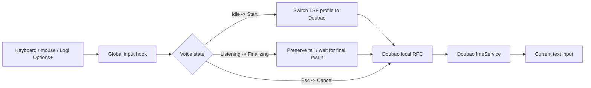

# DoubaoVoiceHotkey

[简体中文](README.md)

<p align="center">
  
</p>

A small, unofficial Windows tray utility that turns a global keyboard key or mouse side button into controllable Doubao IME voice input.

> **Status:** early alpha. The project uses an undocumented local interface of the installed Doubao IME. It may break when Doubao changes its internal RPC protocol.

## What it does

Default behavior:

| Input | Action |
| --- | --- |
| `F8` | First press starts voice input; second press stops and commits |
| `Esc` | Cancels the current voice session |
| `HoldKey` (optional) | Key down starts; key up stops |
| `XButton1` / `XButton2` (optional) | Mouse side buttons can be bound directly |

This makes the common Logitech workflow simple:

```text
Logi Options+ side button -> F8 -> DoubaoVoiceHotkey -> Doubao local RPC
```

If Windows exposes the side button as `XButton1`/`XButton2` directly, set `ToggleKey` to that value and skip the F8 mapping.

## Why this exists

Some versions of Doubao IME distinguish physical left/right modifier keys and may ignore synthetic modifier events generated by automation tools. DoubaoVoiceHotkey does not emulate `Right Alt`. It talks to the locally installed Doubao IME service through its local RPC library.



## Quick start

1. Install and enable Doubao IME on Windows.
2. Run `DoubaoVoiceHotkey.exe`.
3. Put the caret in any text field.
4. Press `F8` to start voice input.
5. Press `F8` again to enter `Finalizing`: by default the app preserves about 200 ms of tail audio before Stop, then keeps a short settle window before returning to Idle.

The app lives in the system tray. Double-clicking its tray icon opens the settings file.

### Logitech Options+

For a Logitech mouse, a reliable starting configuration is:

```text
Back / side button -> Keyboard shortcut -> F8
```

DoubaoVoiceHotkey consumes the F8 down/up events while capture is enabled, so F8 should not leak into the foreground application.

## Settings

Settings are created at:

```text
%APPDATA%\DoubaoVoiceHotkey\settings.json
```

Default configuration:

```json
{
  "ToggleKey": "F8",
  "HoldKey": "None",
  "CancelKey": "Escape",
  "SwitchToDoubaoBeforeVoice": true,
  "AfterImeSwitchDelayMs": 350,
  "ShowWaveDelayMs": 100,
  "StopGraceMs": 200,
  "PostStopSettleMs": 400,
  "RpcWaitMs": 3000,
  "ShowErrorNotifications": true
}
```

Supported single-key bindings currently include `F1`-`F24`, `Escape`, `RAlt`, `LAlt`, `RCtrl`, `LCtrl`, `RShift`, `LShift`, `Space`, `Tab`, `PageUp`, `PageDown`, `XButton1`, `XButton2`, and `None`.

Examples:

```json
{
  "ToggleKey": "XButton1",
  "HoldKey": "None"
}
```

or push-to-talk:

```json
{
  "ToggleKey": "None",
  "HoldKey": "F8"
}
```

Use **Reload settings** from the tray menu after editing.

## Self-check

The tray menu contains two checks:

- **Run self-check**: finds the Doubao TSF profile, resolves the local RPC DLL, and checks whether the named pipe is available. It does not start recording.
- **Run live RPC self-check**: starts Doubao voice briefly and sends Stop. This intentionally activates the microphone through Doubao.

The result is written to:

```text
%LOCALAPPDATA%\DoubaoVoiceHotkey\probe-result.txt
```

Application logs are written to:

```text
%LOCALAPPDATA%\DoubaoVoiceHotkey\app.log
```

## RPC compatibility

The current implementation recognizes two local layouts seen in recent Doubao IME builds:

- `doubaoime-rpc-new.dll` located next to `ImeService.exe`;
- `rpc.dll` inside a `DoubaoIME\versions\...` directory.

Current internal message mapping:

| Message | Value |
| --- | ---: |
| Start | `0x3EF` / `1007` |
| Stop + commit | `0x3F0` / `1008` |
| Show voice UI | `0x3F4` / `1012` |
| Cancel | `0x3F5` / `1013` |

These values are **not a public ByteDance API**. See [`docs/PROTOCOL.md`](docs/PROTOCOL.md).

## Build from source

Requirements:

- Windows 10/11 x64
- .NET 8 SDK

```powershell
dotnet restore .\src\DoubaoVoiceHotkey\DoubaoVoiceHotkey.csproj
dotnet publish .\src\DoubaoVoiceHotkey\DoubaoVoiceHotkey.csproj `
  -c Release -r win-x64 --self-contained true `
  -p:PublishSingleFile=true `
  -o .\artifacts\win-x64
```

The GitHub Actions workflow builds the same self-contained single-file executable on `windows-latest`.

## Clean-room and distribution boundaries

This repository is a fresh implementation. It does **not** contain or redistribute:

- Doubao / ByteDance binaries;
- third-party binaries, extracted scripts, icons, or other assets;
- source code copied from repositories that do not grant a license.

The implementation uses Windows TSF documentation plus observable facts about an undocumented local RPC protocol. The icon and project assets in this repository were created specifically for DoubaoVoiceHotkey.

## Disclaimer

DoubaoVoiceHotkey is an independent, unofficial project. It is not affiliated with, endorsed by, or sponsored by ByteDance or Doubao. “Doubao” is used only to identify the compatible third-party input method.

Because the integration relies on undocumented local interfaces, compatibility can change without notice. Do not depend on it for safety-critical or data-critical workflows.

## License

MIT. See [LICENSE](LICENSE).

### Tail-loss protection

Stopping immediately after the last syllable can cut off the tail while the speech service is still finalizing it. DoubaoVoiceHotkey uses two configurable guards:

- `StopGraceMs`: keep capturing briefly before sending Stop. Default: `200` ms.
- `PostStopSettleMs`: remain in `Finalizing` after Stop and reject a new Start while the final result settles. Default: `400` ms.

If you still lose the last word, try `StopGraceMs: 300`. If the issue only appears when toggling rapidly, increase `PostStopSettleMs`.
