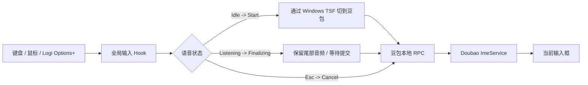

# DoubaoVoiceHotkey

[English](README.en.md)

<p align="center">
  
</p>

DoubaoVoiceHotkey 是一个非官方 Windows 小工具，用全局键盘快捷键或鼠标侧键控制豆包输入法语音输入。

> **状态：早期 Alpha。** 项目依赖豆包输入法当前版本的未公开本地 RPC 接口。豆包升级后，接口可能变化；发布版只有经过对应版本的实机自检，才会标记为已验证兼容。

## 功能

默认配置：

| 输入 | 行为 |
| --- | --- |
| `F8` | 第一次按下开始语音；再次按下停止并提交文字 |
| `Esc` | 语音进行中取消本次输入；空闲时不会拦截 Escape |
| `HoldKey`（可选） | 按下开始，松开停止 |
| `XButton1` / `XButton2`（可选） | 可直接绑定鼠标侧键 |

罗技鼠标可以先用最简单的映射：

```text
Logi Options+ 侧键 -> F8 -> DoubaoVoiceHotkey -> 豆包本地 RPC
```

如果 Windows 能直接收到侧键的 `XButton1` / `XButton2` 事件，也可以把 `ToggleKey` 直接设为对应鼠标键，不经过 F8。

## 为什么这样做

豆包输入法的部分 Windows 版本会区分左右修饰键，并可能不接受普通自动化工具合成的修饰键事件。DoubaoVoiceHotkey 不模拟 `Right Alt`，而是通过本机已安装豆包输入法的 RPC 辅助库控制语音会话。



## 使用

1. 在 Windows 安装并启用豆包输入法。
2. 运行 `DoubaoVoiceHotkey.exe`。
3. 把光标放进任意文本输入框。
4. 按一次 `F8` 开始语音输入。
5. 再按一次 `F8` 进入 `Finalizing`：默认继续保留约 200 ms 尾部音频，再发送 Stop，并等待约 400 ms 让最终结果落定后回到 Idle。

程序常驻系统托盘。双击托盘图标可打开配置文件。

### Logi Options+

建议先配置：

```text
后退键 / 侧键 -> Keyboard shortcut -> F8
```

开启按键捕获时，DoubaoVoiceHotkey 会消费 F8 的按下与松开事件，避免 F8 继续传给前台程序。

## 配置

首次运行后会创建：

```text
%APPDATA%\DoubaoVoiceHotkey\settings.json
```

默认配置：

```json
{
  "ToggleKey": "F8",
  "HoldKey": "None",
  "CancelKey": "Escape",
  "SwitchToDoubaoBeforeVoice": true,
  "AfterImeSwitchDelayMs": 350,
  "ShowWaveDelayMs": 100,
  "StopGraceMs": 200,
  "PostStopSettleMs": 400,
  "RpcWaitMs": 3000,
  "ShowErrorNotifications": true
}
```

当前支持的单键包括 `F1`–`F24`、`Escape`、`RAlt`、`LAlt`、`RCtrl`、`LCtrl`、`RShift`、`LShift`、`Space`、`Tab`、`PageUp`、`PageDown`、`XButton1`、`XButton2` 和 `None`。

直接用鼠标侧键：

```json
{
  "ToggleKey": "XButton1",
  "HoldKey": "None"
}
```

按住说话：

```json
{
  "ToggleKey": "None",
  "HoldKey": "F8"
}
```

修改后在托盘菜单选择 **Reload settings**。

### 尾部漏字保护

如果最后一个字刚说完就立刻按停止，语音服务可能还在处理最后一小段音频。DoubaoVoiceHotkey 默认做两层保护：

- `StopGraceMs`：收到停止操作后，先继续保留一小段录音再发送 Stop。默认 `200` ms。
- `PostStopSettleMs`：Stop 之后保持 `Finalizing` 状态，暂时拒绝新的 Start，给最终识别和提交留出时间。默认 `400` ms。

如果仍偶发漏掉句尾，可先把 `StopGraceMs` 调到 `300`；如果只是连续快速按 F8 时状态容易打架，可增加 `PostStopSettleMs`。这两个参数都会被限制在安全范围内。

## 自检

托盘菜单提供两种检查：

- **Run self-check**：查找豆包 TSF profile、定位本地 RPC DLL，并检查本地命名管道是否可用；不会主动开始录音。
- **Run live RPC self-check**：短暂启动豆包语音，再发送 Stop。这个检查会实际调用麦克风。

结果写入：

```text
%LOCALAPPDATA%\DoubaoVoiceHotkey\probe-result.txt
```

日志写入：

```text
%LOCALAPPDATA%\DoubaoVoiceHotkey\app.log
```

## RPC 兼容性

当前实现识别近期豆包输入法中出现过的两种本地布局：

- `ImeService.exe` 同目录的 `doubaoime-rpc-new.dll`；
- `DoubaoIME\versions\...` 目录中的 `rpc.dll`。

目前已独立交叉核对的语音消息：

| 操作 | 值 |
| --- | ---: |
| Start | `0x3EF` / `1007` |
| Stop + commit | `0x3F0` / `1008` |
| Show voice UI | `0x3F4` / `1012` |
| Cancel | `0x3F5` / `1013` |

这些值属于**未公开的内部接口**，不是字节跳动提供的公共 API。更详细的证据边界和兼容性约定见 [`docs/PROTOCOL.md`](docs/PROTOCOL.md)。

## 从源码构建

要求：

- Windows 10/11 x64
- .NET 8 SDK

```powershell
dotnet restore .\src\DoubaoVoiceHotkey\DoubaoVoiceHotkey.csproj
dotnet publish .\src\DoubaoVoiceHotkey\DoubaoVoiceHotkey.csproj `
  -c Release -r win-x64 --self-contained true `
  -p:PublishSingleFile=true `
  -o .\artifacts\win-x64
```

仓库中的 GitHub Actions 会在 `windows-latest` 上构建同样的 self-contained 单文件程序。

## Clean-room 边界

本仓库是独立重写实现，不包含或再分发：

- 豆包 / 字节跳动二进制文件；
- 第三方可执行文件、反编译脚本、图标或其他资源；
- 未授权开源仓库中的实现代码。

实现依据 Windows TSF 官方接口文档，以及多个独立实现能够相互印证的本地 RPC 互操作事实。仓库图标和其他项目资源均为 DoubaoVoiceHotkey 重新制作。

## 免责声明

DoubaoVoiceHotkey 是独立、非官方项目，与字节跳动或豆包不存在隶属、授权、背书或赞助关系。“Doubao / 豆包”仅用于说明兼容的第三方输入法。

由于集成依赖未公开的本地接口，未来版本可能失效。不要将它用于安全关键或数据关键流程。

## License

MIT，见 [LICENSE](LICENSE)。
